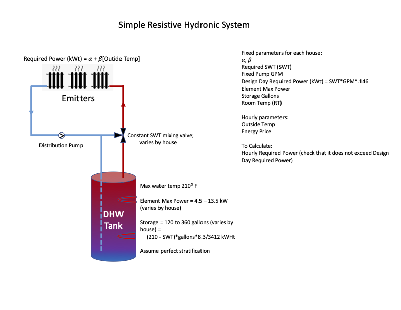

Hello AtomicTNode
=================

AtomicTNodes intro - what they are, what they do.

Walk through the tutorial using an open-source demo strategy for what we call a simple
resistive hydronic heating system. This code emakes some simplifying assumptions that
one would want to adjust for better performance in the field, but captures many of
the core functional concepts of an AtomicTNode operating for a thermal storage
asset that is indeed an appropriate part of the mix for a high renewables future.

